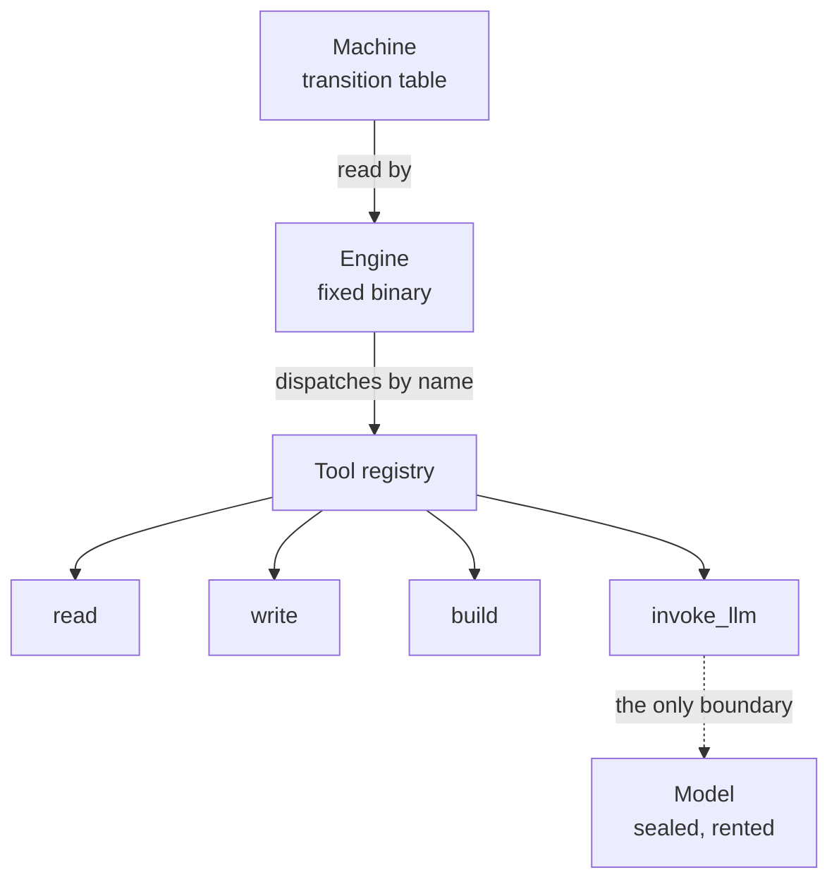
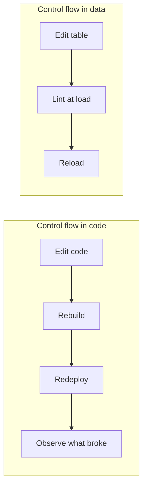

# You Can't Edit the Model

## Learning objectives

After reading this chapter you will be able to:

1. Identify which parts of a deployed agent you can change and which you rent.
2. Write an agent's control flow as a transition table instead of imperative code.
3. Read a machine file and state what the agent will do, without running it.
4. List the checks a loader can run against a transition table before the agent starts.
5. Estimate what a model swap costs under each harness style.

## The part you cannot open

A deployed agent is two factors multiplied: harness times model. One of
those factors is sealed.

**Definition — harness.** Everything around the model call: which tools
exist, which are visible in a given phase, how many retries are allowed,
what validation runs before the agent may declare success, and where the
boundary sits so a bad action cannot reach the system unchecked.

**Definition — model.** The rented inference function. Access terms
forbid opening it, and the weights would not help if they did not.

Every adjustment a team will ever make falls on the harness side. This
is not a limitation of current providers that better models will lift.
A sealed part is the permanent shape of the product.

That leaves one question, and it decomposes into two parts. First, where
does the harness keep its control flow? Second, can that control flow be
checked before it runs? The rest of this chapter answers both, in order.

> **From the Field.** Twenty years of production systems taught me to
> look for the adjustable surface of any component I cannot open. Vendor
> silicon, a proprietary protocol stack, a managed service — the
> engineering question is always the same: what is the surface, and how
> fast can I turn it? For an agent, that surface is the harness. All of
> it.

## Where the control flow lives

The industry arrived at agents in stages, and each stage widened the
consequences of a mistake. A chatbot wraps a model in a transcript, and
its errors stay in the chat. A tool-connected model acts — file writes,
shell commands, API calls — and its errors acquire consequences. A
harness routes responses to tools and feeds failures back, which
improves the odds and leaves one question open: when the model changes,
or the task changes, how does the routing change with it?

In most harnesses the answer is to edit code. Control flow lives in
callbacks and conditionals, tangled with retry handling and logging. An
adjustment as small as "run lint before test" or "stop letting the
planner see the deploy tool" becomes a code change, with a code change's
blast radius and release cycle.

> **Common Error.** Burying the retry budget in a callback. The number
> is a policy decision that operators need to change under load, and it
> ends up in a code path only the harness author can find. The same
> applies to validation ordering and phase-scoped tool visibility: they
> are configuration wearing the costume of implementation.

Anthropic's engineering guidance draws the relevant line: workflows
route the model through predefined code paths, while agents let the
model direct its own process [@anthropic2024agents]. A declarative agent
keeps the workflow's predictability and moves the path into a file.

## Control flow as data

Every agent runs the same loop — observe, decide, act, validate. That
loop is a state machine whether or not anyone writes it as one.

**Definition — declarative agent.** An agent whose control flow is a
transition table in a data file, interpreted by a fixed engine. The
engine is compiled; the behavior is data.

**Definition — machine.** The data file itself: an initial state, a
budget, a set of terminal states, and the transitions between them.

**Definition — transition.** A tuple of current state, incoming signal,
next state, and the action to dispatch. A **signal** is a named outcome
a tool emits; the alphabet of signals is closed and declared.

The `agent-core` runtime released by Nokia Bell Labs is one
implementation [@declarativeagents2026]. A fragment of a real coding
agent's machine file:

```yaml
initial_state: Idle
budget:
  max_iterations: 100
  max_consecutive_parse_errors: 5
terminal_states: [Succeeded, Failed, BudgetExceeded]
transitions:
- state: Idle
  signal: Seed
  next: Composing
  action: invoke_llm
- state: Composing
  signal: LLMResponded
  next: Parsing
  action: parse_response
- state: Parsing
  signal: TaskCompleted
  next: ValidatingBuild
  action: build
```

Read it in order. The agent starts in `Idle`. A `Seed` signal moves it
to `Composing` and dispatches `invoke_llm`. When the model answers, the
`LLMResponded` signal moves it to `Parsing` and dispatches
`parse_response`. When parsing yields `TaskCompleted` — the model
claiming it is finished — the agent does not finish. It moves to
`ValidatingBuild` and runs the build. The model's claim of success is an
input to the machine, never an exit from it.

Three policies that are usually invisible are now on the page. The retry
budget is a number. Validation-before-success is a transition. The rule
that a parse failure returns to the model at most five times is a signal
and a counter.

**Figure 3.1** Architecture of a declarative agent.



*The engine is compiled and unchanged between agents. The machine is
data. Tools are dispatched by name, and exactly one of them —
`invoke_llm` — crosses into probabilistic territory. The model sits
outside the agent, reachable only through that tool, so a model swap
touches a configuration value rather than the engine or the other
tools.*

> **Good Practice.** Route every model call through one declared tool.
> When the boundary is a single named action, the blast radius of a
> provider change is one declaration, and the deterministic part of the
> system can be tested without a network.

## Checking the machine before it runs

A transition table is finite data, which means the loader can answer
questions about the entire behavior space at startup:

| Check | Failure it prevents |
|---|---|
| Is every state reachable? | Dead states written and forgotten |
| Can every run reach a terminal state? | Loops with no exit |
| Is there exactly one transition per state and signal? | Ambiguous dispatch |
| Does every signal a tool emits have a handler? | An outcome nobody planned for |

These checks fail at load, before the agent touches anything. Split a
tool into two, forget to handle one of its signals, and the machine does
not start — the loader names the missing transition. The alternative is
discovering the gap in production, weeks later, when that path finally
runs.

The formalism is old. Statecharts and their static analysis predate
language models by four decades [@harel1987]. What is new is the
application: putting a checkable formalism around a component that
cannot be checked at all.

**Figure 3.2** Two adjustment cycles.



*The declarative cycle removes the rebuild and replaces post-deployment
observation with a check that runs before the agent starts. The
difference compounds: adjustment happens at configuration speed rather
than release speed, and the class of errors caught at load never reaches
production at all.*

A prompt cannot be linted. A pile of callbacks can be tested, at the
cost of writing a test for every path someone remembered to imagine. A
transition table is checked exhaustively, by construction, every time it
loads.

## What it buys when the model changes

Model releases arrive quarterly. Each one behaves differently inside the
same harness, and the only way to learn how is to run it and watch where
the harness blocks what it should allow, or allows what it should block.
Under a declarative harness that adjustment is a reviewable one-line
diff: tighten a budget, add a validation state, hide a tool from one
phase.

The protocol standards emerging around agents solve an adjacent problem.
MCP standardizes how an agent reaches tools [@mcp2024]; it says nothing
about the control flow deciding when a tool may be reached. That
decision is the harness's core, and in most systems it remains the least
inspectable part of it.

The agent loop itself is roughly fifty lines, and the engineering lives
in everything around it [@djukic2026loop]. This chapter is what that
engineering looks like written down: the loop as a table, the tools as
declarations, the model as a rented part behind one boundary.

The model stays sealed either way. The open question is whether the part
you can edit is legible enough to edit well.

## Summary

A deployed agent is a harness multiplied by a model, and only the
harness is adjustable. Writing the harness's control flow as a
transition table in a data file — a declarative agent — makes three
things possible that imperative control flow does not: the behavior can
be read off the page, changed without a rebuild, and checked
exhaustively at load time. The model call becomes one declared tool at a
single boundary, so swapping providers is a configuration change rather
than an engineering project.

## Terms

| Term | Definition |
|---|---|
| **Harness** | Everything around the model call: tools, visibility, budgets, validation, and the boundary |
| **Model** | The rented inference function; sealed, with no user-serviceable parts |
| **Declarative agent** | An agent whose control flow is a transition table interpreted by a fixed engine |
| **Machine** | The data file holding initial state, budget, terminal states, and transitions |
| **Transition** | Current state, incoming signal, next state, action to dispatch |
| **Signal** | A named outcome emitted by a tool; the alphabet is closed and declared |
| **Terminal state** | A state from which no transition leaves; where a run ends |
