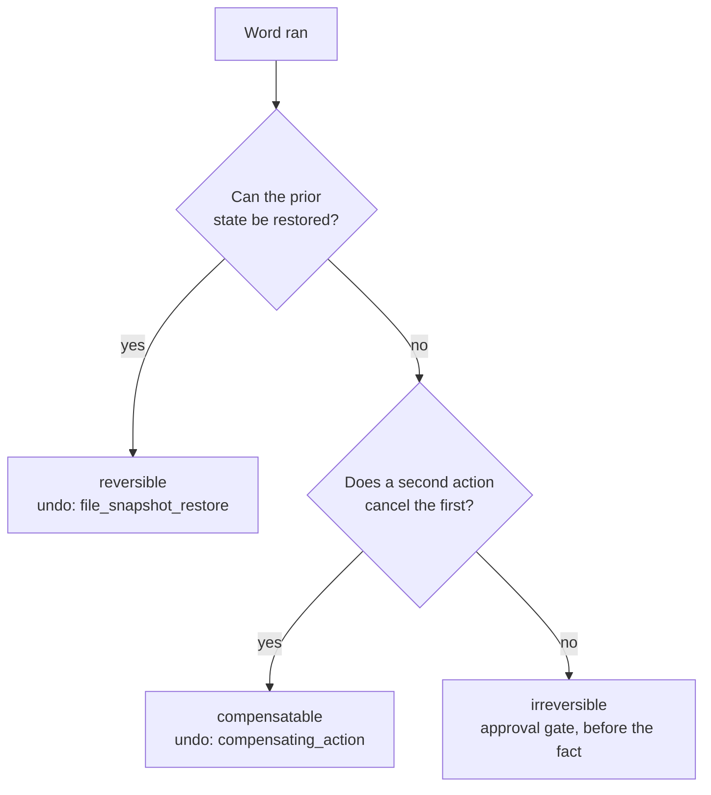

# Every Agent Needs an Undo

## Learning objectives

After reading this chapter you will be able to:

1. Classify a tool's side effect as reversible, compensatable, or irreversible.
2. Say what each classification obliges the tool author to write.
3. Write the undo block of a tool declaration and predict what a rollback replays.
4. Explain what a receipt is and who is allowed to decode one.
5. Recognize the undo declaration that is quietly lying.

## Acting creates a debt

An agent that reads is easy to stop. Kill it mid-query and the world is
where you left it. An agent that writes is a different problem, because
the run can end anywhere, and wherever it ends, something outside the
process has already changed.

Most harnesses treat that as an operations concern. An agent does its
work, someone writes a cleanup script that knows by hand which files to
remove and which rows to delete, and that script drifts from the agent
the week after both are written.

The alternative is to make the reversal part of what a tool declares.
When a word changes something outside the process, its declaration says
what changed and how to change it back. The debt is
recorded where the action is, and the runtime consumes the record when a
run has to be unwound.

> **Common Error.** Writing the compensation into the machine as an
> extra state — an `Undoing` state with its own transitions. It works
> until a second machine uses the same word, and then the reversal
> exists in one caller and not the other. Reversal belongs to the tool,
> which is the thing that knows what it did.

> **From the Field.** The cleanup script is the artifact I have seen
> rot fastest in production systems. It is written the week of the
> incident, it encodes what the pipeline did that month, and nobody
> updates it when the pipeline changes, because it lives in a different
> repository from the thing it cleans up after. Putting the reversal in
> the tool declaration is the same move as putting control flow in a
> machine file, keeping the statement next to the thing it describes.

## Three classifications

The reversibility classification answers one question: after this word
has run, what does it take to get back?

| Classification | Means | The tool must supply |
|---|---|---|
| `reversible` | The prior state can be restored exactly | A receipt, when the word mutates state |
| `compensatable` | The effect cannot be lifted, but a second action cancels it | An action that cancels it, and what that action needs to know |
| `irreversible` | Nothing gets it back | An admission, and usually an approval gate before the fact |

**Figure 4.1** What it takes to get back.



*The classification is the author's answer to the first question the
runtime asks at rollback. Answering it wrong costs nothing until a run
has to be unwound, which is why the answer belongs in the file rather
than in someone's memory of what the tool does.*

The first is the file case. A word that writes a file can record what
the file held before, so restoring it is a copy:

<!-- listing: c4-1 source=large-context-swarm/agents/rlm-root/declarations.yaml -->

```yaml
    side_effects:
      - kind: filesystem_write
        target: worker-seed.json
        state: seed_written
    reversibility: {classification: reversible}
    undo: {strategy: file_snapshot_restore, description: Restore the prior file state from the receipt.}
```

Three things are declared there and none of them is code. A kind and a
target let a reader see what this word touches without running it, and
the classification says a restore is possible. The strategy does the
rest, and `file_snapshot_restore` is a reversal the runtime already
knows rather than a function this author wrote [@declarativeagents2026].

Compensation is the interesting case, and where most agents get into
trouble. Some effects cannot be lifted. A record written into a
collection through an API can be deleted afterward, but that is a new
write, not an undo, and it only works if something remembered which
records to delete. That remembering is the next section; the third
classification, where nothing gets anything back, closes the chapter.

## Receipts

A receipt is what a word records at the moment it acts so that its
reversal can run much later, in a process that no longer has any of the
context. The runtime stores receipts verbatim and never interprets them.
The tool that wrote one is the only thing that decodes it.

Read the swarm's dispatch word next, because its effect reaches two
places at once:

<!-- listing: c4-2 source=large-context-swarm/agents/rlm-root/declarations.yaml -->

```yaml
    side_effects:
      - kind: child_process
        target: rlm_worker
        state: worker_running
      - kind: external_api
        target: chroma.records
        state: records_added
        description: The child writes its finding to the blackboard collection.
    reversibility:
      classification: compensatable
    undo:
      strategy: compensating_action
      description: Delete the records the dispatched workers wrote for this round.
      payload: boundary_compensation
      captures: [collection, round]
```

The word launches a child process, and the child writes to a collection
over the network. Neither effect can be restored, so the classification
is `compensatable` and the reversal is a delete.

What makes it work is `captures`. Undo runs later, after the
machine has moved on and possibly after the process has exited, and by
then nothing remembers which collection this round used or which round
this was. So the word captures both at dispatch time. That pair is what the
receipt has to carry, and it is exactly enough to address the delete
that cancels what the workers wrote.

Notice what is not in the receipt. The findings themselves are not
there, and neither is the child's output. A receipt holds what the
reversal needs and nothing else, which keeps it small enough to store
with every checkpoint and dull enough to be safe if someone reads it.

> **Good Practice.** Capture the identifiers, not the payload. If the
> compensation is a delete, the receipt needs the address of what to
> delete. Storing the content as well doubles the checkpoint and adds a
> second copy of data you may have been careful about.

## The undo that lies

Most words in a machine declare `strategy: noop`, and for most of them
it is the right answer. A word that composes a value, parses a plan, or
compares a counter against a bound changes nothing outside the process,
so there is nothing to reverse. Read-only commands return no receipt and
use a no-op undo, which is what the runtime's rollback contract says
[@declarativeagents2026].

A `noop` on a word that does change something is the failure mode. It
costs nothing to write, it passes every check, and it produces a
rollback that reports success while leaving the effect in place. That
same contract names the hazard directly — a no-op undo on a
state-mutating command leaves residual risk after rollback. No static
check catches it, because whether a word mutates is a fact about the
service it calls rather than about the file.

Reading the real declarations takes one more piece of vocabulary. Four
words in the swarm's root declare a `side_effects` block *and* a `noop`
undo, which looks like the failure above and is not: each of those
effects carries `state: read_only`. The `state` field is what licenses
the reversal, so the test is not whether a word declares side effects,
but whether any of them reports a change.

The third classification covers what no compensation reaches. An email
that was sent, a payment that cleared, an artifact published somewhere
other people already pulled from. Declaring `irreversible` is not an
admission of a poorly built tool. It is the only accurate thing to
write, and it changes what the surrounding machine can do. The runtime
reports irreversible receipts rather than inventing a restore path, and
the normal way to protect such an action is an approval gate before it
runs.

The corpus family this book copies carries one. `delete_records` in
`catalog/agents/knowledge-manager/corpus-rest.yaml` is classified
`irreversible` and sets `requires_confirmation: true`, because deleting
records from a collection is not a thing a receipt can walk back. The
swarm never selects that word — none of its machines list it in
`tools.yaml` — so no run in this book performs an irreversible action.
That is a property of this application rather than of the substrate.

## Summary

An agent that acts owes a reversal, and the tool contract is where that
debt gets written down. Three classifications cover the ground:
`reversible` when a receipt can restore the prior state, `compensatable`
when a second action cancels the first, and `irreversible` when nothing
does. The receipt is the mechanism underneath all three — a small record
written at the moment of action, holding the identifiers a later
reversal needs, and opaque to everything but its author. The declaration
that deserves suspicion is a `noop` undo on a word whose side effects
say it touched something, because nothing in the toolchain will catch
it and a rollback will report success anyway.

## Terms

| Term | Definition |
|---|---|
| **Reversibility classification** | A tool's declared answer to what it takes to get back: reversible, compensatable, or irreversible |
| **Undo strategy** | The named reversal the runtime runs, such as `noop`, `file_snapshot_restore`, or `compensating_action` |
| **Receipt** | What a word records at action time so its reversal can run later; stored verbatim, decoded only by the tool that wrote it |
| **Captures** | The fields a compensating action needs to find its target, named in the undo block |
| **Compensating action** | A new action that cancels an earlier one when the earlier one cannot be lifted |
| **Approval gate** | A machine-declared stop before an irreversible action, since there is no reversal to fall back on |
