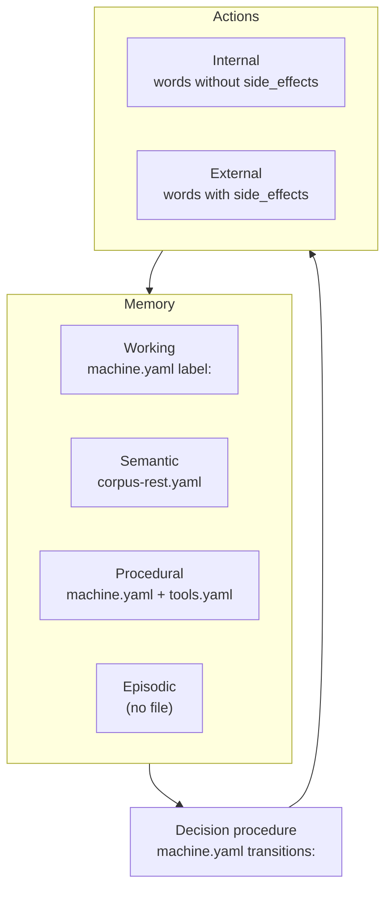

# The Map: CoALA With a File Path in Every Box

**Paper:** Sumers, Yao, Narasimhan, Griffiths (2023). *Cognitive
Architectures for Language Agents*. arXiv:2309.02427.

CoALA gave agent research a shared vocabulary — memory split four ways,
actions split into internal and external, and a decision procedure
choosing among them [@coala-2023]. It is the closest thing the field has
to a common map, and it stays abstract, because a taxonomy meant to
cover systems its authors never saw cannot name any of their files.

This chapter names files. Every box in the taxonomy gets a path in one
repository of declarative machines, so a reader can see what holds
working memory and what a decision procedure looks like once it is a
transition table instead of a prompt. The useful part of the exercise is
finding where a real system refuses to fold into the map.

> **The retest.** CoALA claims a vocabulary general enough that any
> language agent can be described in its terms. Three years later, this
> chapter lays that vocabulary over one running repository and reports
> which boxes hold a path and which hold nothing.

## What the paper claims

CoALA organizes a language agent into three parts. There are four
memories. *Working* memory is what the agent is dealing with right now,
*semantic* memory covers facts about the world, *episodic* memory keeps
the agent's own past experience, and *procedural* memory is where its
skills live. Actions divide in two. An *internal* action moves
information around inside the agent, by reasoning over working memory or
by reading from and writing to the longer-term stores; an *external*
action reaches the world. A decision procedure sits between them,
proposing candidate actions and selecting one.

The paper's contribution is organizing rather than inventing. It draws
the line from production systems and Soar through to language agents,
and argues that the field keeps rebuilding the same parts without
agreeing on names. Retesting it therefore has no algorithm to rerun and
no benchmark to reproduce. The claim has to be restated as something a
repository can falsify — point at every box, and see whether a file is
there.

The subject is a swarm of declarative agents built to test a different
claim entirely, from a paper three years newer. Nothing in it was
arranged to flatter this taxonomy, which is what makes it worth laying
the taxonomy over.

## The mapping

Every box below resolves to a path that exists at the release
`examples/MANIFEST.yaml` pins, except one, and that blank line is the
most useful row in the table.

| CoALA box | Path | What sits there |
|---|---|---|
| Working memory | `agents/rlm-root/machine.yaml`, the `label:` fields | The previous word's result, republished under a name |
| Semantic memory | `catalog/agents/knowledge-manager/corpus-rest.yaml` | The collection holding the corpus and the findings written back to it |
| Procedural memory | `agents/rlm-root/machine.yaml` and `tools.yaml` | The order of operations, and which words exist at all |
| Episodic memory | — | Nothing the agent reads |
| Internal action | `agents/rlm-root/declarations.yaml`, words with no `side_effects` | Composing, parsing, comparing a counter |
| External action | Same file, words that declare `side_effects` | Dispatching a worker, querying the collection, writing an entry |
| Reasoning | `agents/rlm-root/llm.yaml` | The two model calls: plan the intents, reduce the findings |
| Decision procedure | `agents/rlm-root/machine.yaml`, `transitions:` | State, incoming signal, next state, action to dispatch |

**Figure 9.1** The taxonomy with paths in the boxes.



*Three of the four memory boxes carry a path, and the section on what
the machine forced explains why the empty one is a finding about the
taxonomy rather than a gap in the repository.*

The decision procedure is the box that changes most when it becomes a
file. In a prompt-driven agent it is an instruction and a hope. Here it
is a table, and the whole of it can be read before anything runs:

<!-- listing: c9-1 source=large-context-swarm/agents/rlm-root/machine.yaml -->

```yaml
  - state: Idle
    signal: Seed
    next: CapturingRequest
    action: capture_request
    label: request

  - state: CapturingRequest
    signal: RequestCaptured
    next: SeedingRound
    action: seed_round
    label: round_count
  - state: CapturingRequest
    signal: CommandError
    next: Failed
```

Read the first entry as a sentence. In state `Idle`, on signal `Seed`,
go to `CapturingRequest` and dispatch `capture_request`, storing what
that word returns under the name `request`. Proposal, evaluation, and
selection have collapsed into a lookup, where a state and a signal admit
one legal next step, and the runtime refuses any transition the file
never declared [@declarativeagents2026]. The `label:` field is working
memory being written, in the only place it can be written.

That leaves the action boxes, and the file draws their boundary in a
place the paper does not:

<!-- listing: c9-2 source=large-context-swarm/agents/rlm-root/llm.yaml -->

```yaml
    side_effects:
      - kind: external_api
        target: ollama.generate
        state: read_only
```

That declaration belongs to `plan_intents`, the word that asks the model
to decompose the task. Under CoALA, reasoning is the canonical internal
action. Under the file, it reaches an external API.

## What the machine forced, and what aged

Laying the map over a working repository turned up four places where the
boxes and the files disagree. A taxonomy written for a field cannot
carry the decisions a running system has to make, so each disagreement
below is a decision this machine forced into writing rather than an
error in the paper.

**The word "internal" already meant something else.** The declarations
carry a `visibility:` field, and most words in the root are marked
`visibility: internal`. That has nothing to do with CoALA's internal
actions. It means the word is not offered to the model as something it
may call, only sequenced by the machine. A word can be internal in the
file's sense and external in the paper's, as `collect_findings` is,
since it is never shown to the model and it opens a network connection.
The collision is a naming accident, and it still makes "internal"
ambiguous in the files where the distinction does work.

**The action boundary is drawn at the process edge.** The repository
sorts words by `side_effects`, and that field answers a narrow question
about whether anything outside this process changes, and whether the
change can be undone. Sixteen words in the root declare no side effects
at all. They compose values, parse a plan, or compare a counter against
a bound. The rest declare
`external_api`, `filesystem_write`, or `child_process`. Sorted this way,
both of the model calls fall on the external side, along with every
retrieval from the collection. CoALA would put reasoning and retrieval
on the internal side of the same line.

Both readings are defensible, and the declared one is what has
consequences downstream. Retry policy and undo strategy are written
against `side_effects`, so a word that reaches Ollama gets treated as
something that can fail halfway and leave the world changed. CoALA's
split tracks where information travels, which an operator cannot act on
in the same way. With a rented model behind one boundary and a memory
store behind another, the process edge is the line the machine can
enforce.

**Procedural memory needed two files.** CoALA has one box for skills.
The repository splits it: `machine.yaml` holds the order of operations,
and `tools.yaml` holds the inventory of words that exist. Keeping them
apart is what lets a phase see a narrower set of tools than the agent
owns, which is a routine thing to want and an awkward thing to say with
one box. The split was not a design flourish. It fell out of wanting to
hide the dispatch word from the planner.

**Episodic memory has no file the agent reads.** The runs do leave
traces. The runtime writes an OpenTelemetry log per run, and the demo
asserts six properties against a recorded request log, which is how the
swarm's rule about corpus text is checked at all. But every one of those
readers is a person or a test. No word in any machine reads a previous
run, and
no collection holds one. The emptiness reflects the repository rather
than the taxonomy. Nothing here has yet needed an agent to remember
yesterday, and the moment something does, the shape of what to add sits
in the semantic-memory box next to it.

The verdict is **holds with residue**. Seven of the eight boxes take a
path, and the decision procedure is better off as a file than as the
prose CoALA had to describe it in. Of the four disagreements, three are
about this repository, which needed two files for one box, no file for
another, and had already spent the word "internal" on something else.
The fourth is about the taxonomy, whose line between internal and
external sits somewhere other than where an operator would draw it.

## The exercise

Move one word across the boundary and watch what notices.

Open `examples/applications/large-context-swarm/agents/rlm-root/declarations.yaml`
and find `write_worker_seed`, which declares a `filesystem_write` side
effect. Delete its `side_effects:` block, so the word reads as one that
touches nothing outside the process. Then run both checks:

```bash
mage -d examples test
mage audit
```

Both pass. The word has moved from the external column of the table to
the internal one, the mapping in this chapter is now wrong, and nothing
in the repository objects, because the file still writes a file. In this
substrate the classification is descriptive, while the sequencing is
enforced. The machine will not let a word run in a
state the table never declared, and it will happily let a word lie about
what it touches. Restore the block when you are done, and notice that
`mage audit` would have caught the deletion if a chapter had extracted
that region as a listing.

## Where the empty box goes

The swarm forgets everything the moment a run ends. To make it remember
its own past runs, you add a corpus family beside
`catalog/agents/knowledge-manager/` that stores one record per finished
run rather than one per document, holding the task, the terminal state,
and the path the run took through its states, tagged with the same three
provenance fields the swarm's collection already uses. Then you add one
word to a machine that queries it before planning, which is the part
that turns a stored
transcript into memory rather than an archive. The write block exists
already, and the query word is the one the workers use. What is missing
is a profile that points them at run transcripts instead of documents,
and a reason to look.

## The question this leaves

Every chapter after this one rebuilds a paper's mechanism on this
substrate, and the mapping above is the vocabulary those chapters use.
When you meet the next agent paper, before asking whether its results
hold, ask the question this one answers: which box is this, and what
file would it be?
